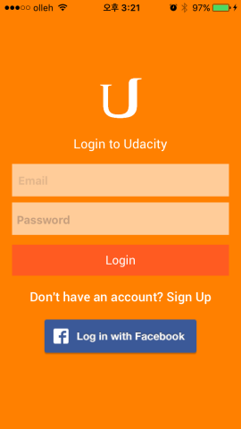

# On-the-Map
This application allow users to see information posted by other students who are attending a course in Udacity. The map will contain pins that show information where other students have reported studying.  By tapping on the pin users can see URL for something the students finds interesting. The user will be able to add their own data by posting a string that can be geocoded to a location, and a URL.


 


# How to build 

1) Clone the repository 
```
$ git clone https://github.com/woogii/On-the-Map.git
$ cd VirtualTourist
```
2) Open the workspace in XCode 
```
$ open VirtualTourist.xcodeproj/
```
3) Compile and run the app in your simulator 

# Compatibility 
The code of this project works in Swift2.0, Xcode 7.0 and iOS9 
